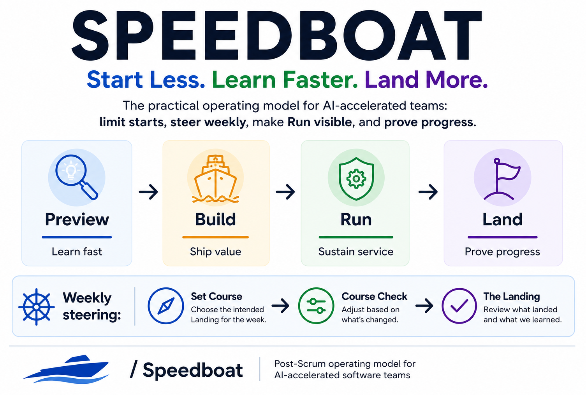

**Start Less. Learn Faster. Land More.**

Speedboat helps AI-accelerated teams finish meaningful work, not just start more work. It keeps teams focused through a simple weekly loop: limit starts, make Run visible, and prove what Landed.

Every week, the team asks:

> **What meaningful thing are we landing this week?**

---

## The model in 60 seconds

Speedboat uses three work lanes and one outcome layer:

| Concept | Plain meaning | What it is for |
|---|---|---|
| **Preview** | Learn fast | Explore, prototype, test assumptions, and make decisions before committing to production work. |
| **Build** | Ship value | Deliver production-grade changes that are safe, usable, and valuable. |
| **Run** | Sustain service | Make operational work visible: incidents, support, reliability, maintenance, compliance, and customer-impacting fixes. |
| **Land** | Prove progress | Record meaningful outcomes: something reached a real beneficiary, or new evidence changed what happens next. |

The goal is not to do more work.  
The goal is to **Start Less. Learn Faster. Land More.**

---

## A normal Speedboat week

| When | Conversation | Purpose |
|---|---|---|
| **Monday** | **Set Course** | Decide what the team is trying to Land this week. |
| **Wednesday** | **Course Check** | Adjust before the week is lost. |
| **Friday** | **The Landing** | Review what landed, what did not, and what was learned. |

This is the core operating loop.

Route Planning keeps the next few weeks shaped enough that Monday does not become backlog grooming. It is part of sustained Speedboat use, but you can defer the first Route Planning session if the team already has enough shaped work for Week 1.

Learning Review and Fleet Sync are used later to improve and scale the model.

---

## Choose your path

Choose the path that matches what you need:

| I want to... | Start with... |
|---|---|
| Understand Speedboat quickly | [Speedboat on a Page](docs/one-page-summary.md) |
| Try it with a team next week | [Getting Started](guides/getting-started.md) |
| Classify real work into Preview, Build, or Run | [Which Lane?](guides/which-lane.md) |
| Understand the full operating model | [Operating Model](docs/model.md) |
| Set up a Jira board without a process migration | [Jira Setup](setup/jira.md) |
| Explain it to leadership or run a formal trial | [Leadership Brief](docs/leadership-brief.md) |
| Understand how AI agents fit | [AI Agents](docs/ai-agents.md) |
| Answer common objections | [FAQ](docs/faq.md) |

---

## How to start next week

You do **not** need to understand the whole framework before starting.

For Week 1, use only the basics:

1. Keep your existing board.
2. Make **Preview**, **Build**, and **Run** visible using labels, swimlanes, or columns.
3. Pick **1–2 intended Landings** for the week.
4. Limit active work: default to **max 3 Preview** and **max 3 Build** items in flight. Count meaningful work items, not individual tickets.
5. Run **Set Course** on Monday.
6. Run **Course Check** on Wednesday.
7. Run **The Landing** on Friday.
8. Record what Landed and what the team learned.

A WIP item is not a subtask. It is a meaningful unit of work the team is steering: a prototype, a feature slice, a production change, or another outcome-sized piece of work.

Do not redesign Jira.  
Do not clean the whole backlog.  
Do not introduce every template.  
Do not start with every ceremony.  
Do not wait for perfect tooling.

Start the rhythm first.

---

## Example week

### Monday: intended Landings

The team chooses two intended Landings:

1. **Customer Landing**: saved filters enabled for three beta customers behind a feature flag.
2. **Decision Landing**: decide whether AI-generated segment suggestions are worth building.

### Work in flight

| Lane | Work |
|---|---|
| **Preview** | Prototype AI-generated segment suggestions. |
| **Build** | Saved filters beta; billing retry hardening. |
| **Run** | Investigate timeout alerts; support escalation for import failures. |

### Wednesday: Course Check

Run work is taking more time than expected. The team narrows billing retry hardening to diagnostics only and keeps saved filters as the primary Landing.

### Friday: The Landing

The team records:

- **Customer Landing**: saved filters enabled for three beta customers; support notes shared; first usage review scheduled.
- **Decision Landing**: AI segment suggestions parked because the Preview showed weak signal quality with current customer data.
- **Run learning**: timeout root cause identified; follow-up Build item created for next week.

That is a successful Speedboat week even though not everything finished.

---

## What good enough looks like in Week 1

Week 1 is not about perfect process. It is about creating visibility and learning.

Good enough means:

- the team can name what it tried to Land;
- current work is visible as Preview, Build, or Run;
- Run work is no longer hidden;
- the team started less than it otherwise would have;
- at least one outcome, decision, or learning was recorded;
- the team knows what to adjust next week.

---

## Common first-week mistakes

### 1. Treating The Landing as a status meeting

Do not go person by person.

Ask:

> What changed for a beneficiary?  
> What reached a usable state?  
> What did we learn that changes what we do next?

### 2. Letting Preview run forever

Preview should end in a decision:

- **promote** to Build;
- **continue** for one more explicit timebox;
- **park** for later;
- **kill** because the evidence does not support continuing.

### 3. Hiding Run work

Run is not a failure. Hidden Run is the problem.

If incidents, support, maintenance, reliability, or customer-impacting fixes consume time, make them visible and adjust the week.

---

## How Speedboat grows

Speedboat is simple to start, but not simplistic to run.

| Stage | Focus | What to add |
|---|---|---|
| **Week 1: Start** | Use the core loop. | Preview, Build, Run, Land; Set Course, Course Check, The Landing. |
| **Weeks 2–3: Sustain** | Keep future work shaped. | Route Planning, Landing Log, Weekly Snapshot. |
| **Weeks 4+: Improve** | Tune the operating model. | Learning Review, landing mix, WIP diagnostics, team feedback. |
| **Multiple teams: Scale** | Coordinate across boats. | Fleet Sync, stakeholder summaries, shared dependency visibility. |

A useful way to remember this:

> **Start with weekly steering. Sustain it with Route Planning. Improve it with Learning Review. Scale it with Fleet Sync.**

---

## Core principles

1. **Start less than you could.**  
   AI makes starting cheap. Speedboat protects finishing.

2. **Make Run visible.**  
   Operational reality is part of the system, not an interruption to it.

3. **Land outcomes, not activity.**  
   Progress means something meaningful reached a beneficiary or changed what happens next.

---

## Repository structure

| Area | Purpose |
|---|---|
| [`docs/`](docs/index.md) | Core model, rationale, FAQ, leadership material, and AI-agent guidance. |
| [`guides/`](guides/index.md) | Practical adoption guides, including getting started and choosing the right lane. |
| [`guides/ceremonies/`](guides/ceremonies/index.md) | Facilitation guides for Set Course, Course Check, The Landing, Route Planning, Learning Review, and Fleet Sync. |
| [`templates/`](templates/index.md) | Lightweight templates for Landings, snapshots, decisions, trials, and stakeholder communication. |
| [`setup/`](setup/index.md) | Tooling setup guidance, including Jira. |

---

## License

Speedboat is licensed under the Creative Commons Attribution 4.0 International License (CC BY 4.0).

You are free to share and adapt the material for any purpose, including commercial use, as long as appropriate credit is given.

Attribution: **Speedboat by Marcus Bransbury** — <https://github.com/bransbury/Speedboat>
